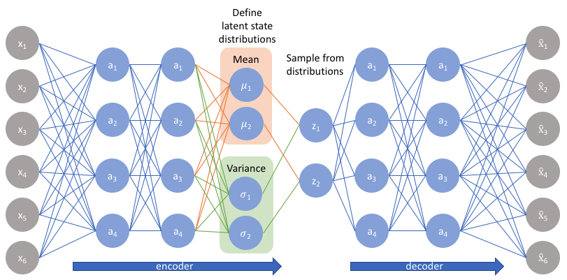

## Variational AutoEncoders

Variational Autoencoders (VAEs) have one fundamentally unique property that separates them from vanilla autoencoders, and it is this property that makes them so useful for generative modeling: their latent spaces are, by design, continuous, allowing easy random sampling and interpolation.

It achieves this by making its encoder NOT output an encoding vector of size n, but rather, outputting two vectors of size n: a vector of means μ, and another vector of standard deviations σ!

So the encoder predicts two kinds of vectors, mean and std. When now we send data to the decoder we sample from this mean and std!

This stochastic generation means, that even for the same input, while the mean and standard deviations remain the same, the actual encoding will somewhat vary on every single pass, simply due to sampling!

Intuitively, the mean vector controls where the encoding of an input should be centered around, while the standard deviation controls the "area", or how much from the mean the encoding can vary!

As encodings are generated at random from anywhere inside the "circle" (the distribution), the decoder learns that not only a single point in latent space refers to a sample of the class, but all near points refer to the same as well. This allows the decoder to not just decode single, specific encodings in the latent space (leaving the decodable latent space discontinuous), but ones that slightly vary too, as the decoder is exposed to a range of variations of the encoding of the same input during training.

### Loss function

The loss that implemented for the VAE is called the ELBO.

$$
{\min \mathbb{E}_{q}[ \log q(z|x) - \log p(z)]} - {\mathbb{E}_{q} \log p(x|z)}
$$

The first term is the KL-divergence and the second term the reconstruction.

#### What is the ELBO?
ELBO stands for evidence lower bound and it has two terms

Term 1: Reconstruction
$$
- \mathbb{E}_q \log p(x|z)
$$

Term 2: KL divergence
$$
\mathbb{E}_{q}  \log \frac{q(z|x)}{p(z)}
$$

#### Math

We want to model a distribution over inputs, $ p(x) $, which are images in this case. We assume that there are factors that influence x but that we can't observe. We call these *latent* variables. We use $z$ to refer to these.

So, by using marginalization, we can rewrite this as

$$
p(x) = \int_z p(x, z)dz
$$

The joint model that uses $z$ variables to explain $x$ is defined by:

$$
p(x,z) = p(z|x)p(x)\\
$$

But again, we find the $p(x)$ term. To solve this we define $q(z|x)$ to approximate $p(z|x)$. $q$ is called the approximate posterior and $p$ the true posterior.

We have a source ($p$) and a target ($q$). We can treat this as an optimization problem where we parametrize $q$ (ie: a neural network) to try to get close to $p$ via gradient descent. This is called variational inference (in general).

The distance to minimize is called the KL divergence.
When we minimize the KL divergence, our $q$ will be an estimator of $p$. This is the definition for the KL divergence between two distributions P, Q:

$$
D_{KL}(Q||P) = \sum Q \log \frac{Q}{P}
$$

We'll replace Q, P with our distributions $P = p(z|x)$ and $Q = q(z|x)$
$$
D_{KL}(q(z|x)||p(z|x)) = \sum q(z|x) \log \frac{q(z|x)}{p(z|x)}
$$

#### ELBO derivation from KL(Q||P)

$$
\begin{align}
D_{KL}(q(z|x)||p(z|x)) &= \sum q(z|x) \log \frac{q(z|x)}{p(z|x)}\\
&= -\sum q(z|x) \log \frac{p(z|x)}{q(z|x)}\\
&= -\sum q(z|x)  \left[\log p(z|x) - \log q(z|x) \right]\\
&= -\sum q(z|x) \left[\log \frac{p(x|z)p(z)}{p(x)} - \log q(z|x) \right]\\
&= -\sum q(z|x) \left[\log p(x|z) + \log p(z) - \log p(x) - \log q(z|x) \right]\\
&= \sum q(z|x) \left[-\log p(x|z) - \log p(z) + \log p(x) + \log q(z|x) \right]\\

D_{KL}(q(z|x)||p(z|x)) - \sum q(z|x) \left[-\log p(x|z) - \log p(z) + \log q(z|x) \right] &= \log p(x)\\
-\sum q(z|x) \left[-\log p(x|z) + \log \frac{q(z|x)}{p(z)} \right] &= \\
-\mathbb{E}_{z \sim q(z|x)} \left[-\log p(x|z) + \log \frac{q(z|x)}{p(z)} \right] &=\\
-\mathbb{E}_{q} \left[-\log p(x|z) + \log \frac{q(z|x)}{p(z)} \right] &=\\
\mathbb{E}_{q} \left[\log p(x|z) - \log \frac{q(z|x)}{p(z)} \right] &=\\
D_{KL}(q(z|x)||p(z|x)) + \left[ \mathbb{E}_{q} \log p(x|z)  - \mathbb{E}_{q}  \log \frac{q(z|x)}{p(z)} \right] &= \log p(x)\\
\end{align}
$$

The first term is the original $D_{KL}$ we want to minimize. The second term is called the variational lower bound (ELBO). Since $ \log p(x)$ is a constant, and we want to minimize the $D_{KL}$ term, we can achieve the same by maximizing the ELBO.

To maximize the ELBO, we can minimize the negative of the ELBO. So, the end goal is to minimize this function:

$$
{\min \mathbb{E}_{q}[ \log q(z|x) - \log p(z)]} - {\mathbb{E}_{q} \log p(x|z)}
$$

#### KL Divergence term
And since we don't know the KL between all possible pairs of distributions, we'll not compute it analytically and instead use monte-carlo sampling for this.

$$
\mathbb{E}_p = \frac{1}{N}\sum_{}p(x)
$$

This means we don't need to know what the distribution is, but only sample from it. So, anywhere we see $\mathbb{E}_q$ we will draw a sample from q and use it in the formula.

#### Reconstruction loss term
The decoder is going to take as input $z$ and it will generate PARAMETERS for a distribution from which to sample a reconstruction. So the reconstruction loss is computed as the negative log-likelihood of the data under a Gaussian distribution instead of MSE loss. This approach is more flexible and can model uncertainty in the reconstruction, which is beneficial in many scenarios where the data may not be perfectly Gaussian or where we want to model the noise explicitly and also avoids blurry reconstructions.

Check out the implementation [here](./variational_ae.ipynb)

The trained model can be found [here](https://drive.google.com/file/d/1hjhXPiI41cZmqukPSJGvMRFICWVXwgd6/view?usp=drive_link)