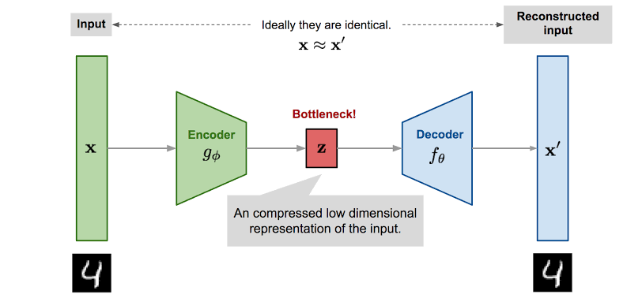
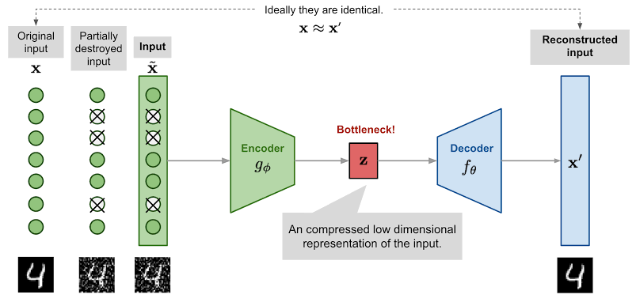

## AutoEncoders

Autoencoders are a type of neural network architecture used for unsupervised learning, where the goal is to learn a compressed representation (encoding) of the input data. The basic idea behind autoencoders is to learn a function that maps the input data to a lower-dimensional representation and then reconstructs the original data from the encoded representation. An AutoEncoder consists of two parts: an encoder and a decoder

### Applications of AE
Autoencoders can be used for a variety of tasks: data compression, denoising, and anomaly detection. Slight modifications to AEs can help us in image generation, image super-resolution, style transfer, text generation, recommendation systems and data augmentation.

### Limitations

Standard autoencoders learn to generate compact representations and reconstruct their inputs well, but aside from a few applications like denoising, etc, they are fairly limited. 

The fundamental problem with autoencoders is that the latent space they convert their inputs to and where their encoded vectors lie, may not be continuous, or allow for easy interpolation. This is fine if you're just replicating the same image.

But when you're building a generative model, you don't want to replicate the same image you put in. You want to randomly sample from the latent space, or generate variations of an input image, i.e. we need a continuous latent space. 

If the space has discontinuities and you generate a variation from en empty space, the decoder will simpy generate an unrealistic output, because the decoder has no idea how to deal with that region of the latent space. During training, it never saw encoded vectors coming from that region of latent space!

Check out the implementation [here](./autoencoder.ipynb)

The trained model can be found [here](https://drive.google.com/file/d/1DBXoqa3S_q4V2vJBMS7RzLPDlHBEULaa/view?usp=sharing)