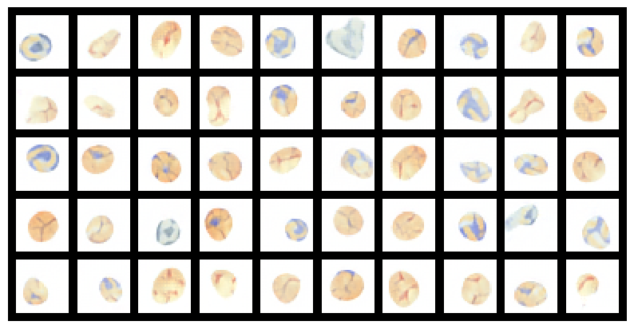
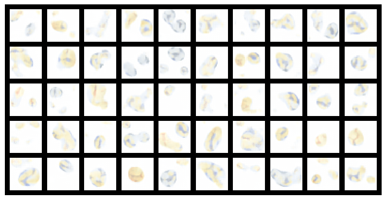

## Assignment 4

The task is to train an Autoencoder and a Variational Autoencoder (VAE) to generate data similar to the sports ball dataset and compare the results. The dataset used to train the models can be found [here](https://drive.google.com/file/d/1a5AlvySFZEk7wY-sXZRXnyvFPRmz2vsn/view?usp=sharing)

Part 1: [Auto encoder](./autoencoder.md)

Part 2: [Variational Auto Encoder](./VAE.md)

### Comparison

Both AEs and VAEs produce high-quality reconstructions on a test set but fail to generate realistic images from random latent vectors. Comparing the effectiveness of AEs and VAEs in generating images from random latent vectors, it could be found that despite the theoretical advantages of VAEs, neither model produced realistic images from random latent vectors.

| AE | VAE |
|----------|----------|
|    |    |

As can be seen from the above figure, the images generated by the AE and VAE from random latent vectors were largely unrecognizable. The generated images often contained vague shapes and textures, but they did not clearly represent any of the ball types. Despite the regularization imposed by the VAE, the latent space structure was insufficient for generating high-quality images from random samples.

**Possible Reasons for Poor Performance**

- Model Complexity: Both the AE and VAE might not have been complex enough to capture the intricacies of the ball dataset.

- Training Data: The quality, diversity, and quantity of the training data might have been insufficient for the models to learn a good representation.

- Latent Space Size: The dimensionality of the latent space could have been inappropriate, either too high or too low, affecting the models' ability to generate realistic images.

### Conclusion

The comparison of images generated from random latent vectors by AE and VAE on a ball dataset revealed that neither model produced realistic images. The AE's unstructured latent space and the VAE's insufficiently regularized latent space both contributed to the generation of low-quality images. To improve performance, future work might explore enhancing model complexity, increasing training data quality and quantity, optimizing latent space dimensionality, adjusting training procedures, and fine-tuning regularization parameters.